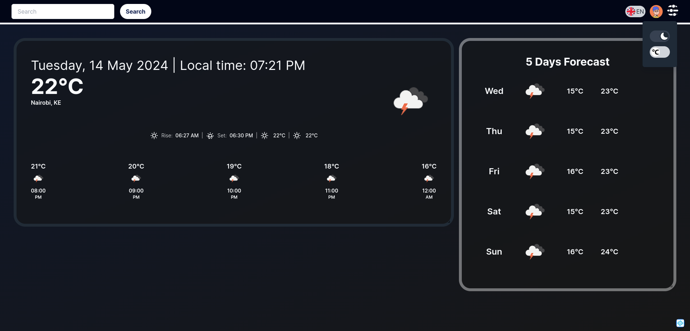
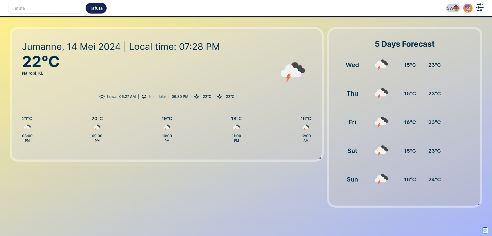

---

# SkySite Weather Dashboard

 

## Table of Contents

- [SkySite Weather Dashboard](#skysite-weather-dashboard)
  - [Table of Contents](#table-of-contents)
  - [Overview](#overview)
  - [Features](#features)
  - [Getting Started](#getting-started)
    - [Prerequisites](#prerequisites)
    - [Steps](#steps)
    - [Creating and Adding `.env` File with API Key](#creating-and-adding-env-file-with-api-key)
  - [Usage](#usage)
  - [Testing](#testing)
  - [Technology Stack](#technology-stack)
  - [Screenshots](#screenshots)
    - [Dashboard View](#dashboard-view)
    - [Dark Mode](#dark-mode)
    - [Language Selection (Swahili)](#language-selection-swahili)
    - [Temperature Selection (F)](#temperature-selection-f)
  - [License](#license)
  - [Contact](#contact)

## Overview

The Weather Dashboard is a dynamic, user-friendly application designed to provide real-time weather updates. Leveraging the OpenWeather API, this dashboard allows users to view weather data for the current day by hour or see forecasts for the upcoming days.


## Features

-  **Real-Time Weather Data**: Displays current weather conditions, including temperature, humidity, wind speed, and atmospheric pressure.
- **Hourly Forecast**: Provides detailed weather predictions for each hour of the current day.
- **Daily Forecast**: Offers a weather outlook for the following days, allowing users to plan ahead.
- **Search Functionality**: Users can search for weather data based on city or geographical coordinates.
- **Language Selection**: An option for users to switch between English and Swahili, making the dashboard accessible to a broader audience.
- **Temperature Units Selection**: Ability to toggle between Fahrenheit (°F) and Celsius (°C) for temperature readings, catering to user preferences.
- **Dark Mode**: A feature allowing users to switch between light and dark themes for better readability and to reduce eye strain, especially in low-light environments.

## Getting Started

### Prerequisites

- [Node.js](https://nodejs.org/) (preferably the latest LTS version)
- npm or yarn (Node Package Manager or Yarn Package Manager)

### Steps

1. Clone the repository:
    ```sh
    git clone https://github.com/Ianodad/Weather-Dashboard.git
    cd your-project
    ```
3. Create an .env file and an openAI key. 
   VITE_OPEN_WEATHER_API=""

   ### Creating and Adding `.env` File with API Key

   1. Create a `.env` file in the root directory of your project:
    ```sh
    touch .env
    ```

   2. Add the following line to the `.env` file, replacing `YOUR_API_KEY` with your actual OpenWeather API key:
    ```sh
    VITE_OPEN_WEATHER_API=YOUR_API_KEY
    ```

   3. Your project should now be able to access the API key via `import.meta.env.VITE_OPEN_WEATHER_API;`.


4. Install dependencies:
    ```sh
    npm install
    ```

## Usage

Explain how to run the project. Include code snippets, if necessary.

```sh
npm run dev
```

Open your browser and navigate to `http://localhost:3000` to view the application.


1. Use the controls at the top of the dashboard to:
   - Change the language between English and Swahili.
   - Toggle temperature units between Fahrenheit and Celsius.
   - Switch between light and dark mode.
2. Search for weather data by entering a city name or geographical coordinates in the search bar.

## Testing

Explain how to run the tests and view the results.

```sh
npm test
```

## Technology Stack

- [React](https://reactjs.org/): JavaScript library for building user interfaces.
- [OpenWeather API](https://openweathermap.org/api): API for accessing weather data.
- [React Router](https://reactrouter.com/): Declarative routing for React applications.
- [Zustand](https://zustand-demo.pmnd.rs/): A small, fast, and scalable state-management solution for React.
- [Tailwind CSS](https://tailwindcss.com/): Utility-first CSS framework for rapid UI development.
- [Vite](https://vitejs.dev/): Next-generation front-end tooling for faster development.
- [Axios](https://axios-http.com/): Promise-based HTTP client for making API requests.
- [Jest](https://jestjs.io/): Delightful JavaScript testing framework.
- [React Testing Library](https://testing-library.com/docs/react-testing-library/intro/): Simple and complete testing utilities that encourage good testing practices.


## Screenshots

### Dashboard View


### Dark Mode


### Language Selection (Swahili)


### Temperature Selection (F)

## License

This project is licensed under the MIT License - see the [LICENSE](LICENSE) file for details.

## Contact

- **Author**: Ian Adera
- **Email**: ianodad@gmail.com
- **GitHub**: [ianodad](https://github.com/ianodad)

---